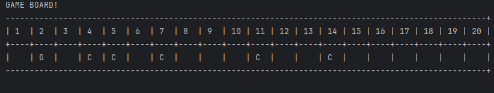

# Plan for Testing the Program

The test plan lays out the actions and data I will use to test the functionality of my program.

Terminology:

- **VALID** data values are those that the program expects
- **BOUNDARY** data values are at the limits of the valid range
- **INVALID** data values are those that the program should reject

---

## Player Names

Can the players input their names into the game and can the game display it on screen?

### Bored display

Does the board display with the coins in the boxes?

### Coins

Do the coins randomly get added to the board when starting game?

