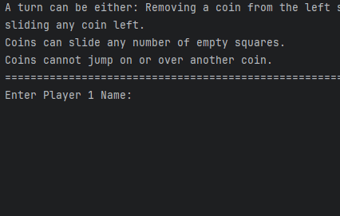

# Results of Testing

The test results show the actual outcome of the testing, following the [Test Plan](test-plan.md)

---

## Test Name

This test is showing that the code for putting in the players name (player1 and player2) works

### Test Data Used

I ran the code to test.

### Test Result

## Example Test Name

This test is to show the coins moving

### Test Data Used

I ran the code to test

### Test Result

Comment on test result. Comment on test result. Comment on test result. Comment on test result. Comment on test result. Comment on test result.

---

